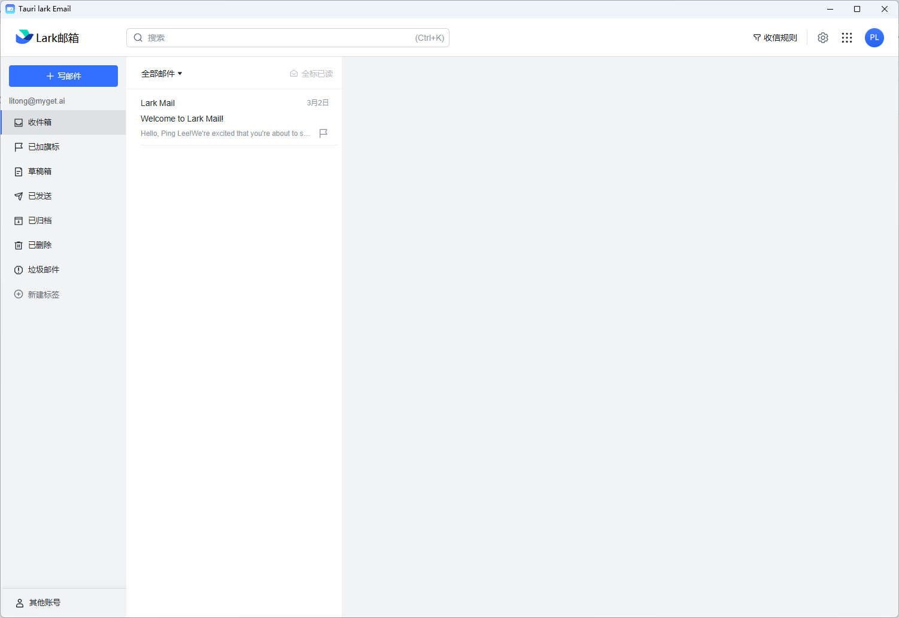

## tauri-translator

A standalone desktop application for translator, built using Tauri.



## Features
* **Native Experience**: Interact with translator directly from your desktop without needing a browser.
* **Fast and Lightweight**: Built using Tauri, the application is light on resources and starts up quickly.
* **Cross-Platform**: Available for Windows, macOS, and Linux.

## Installation

### Pre-built binaries
You can download the pre-built binaries for your platform from the [Releases](https://github.com/litongjava/tauri-translator/releases) page.

### Building from Source

1. Clone this repository:
    ```bash
    git clone https://github.com/litongjava/tauri-translator
    ```
2. Navigate to the project directory:
    ```bash
    cd tauri-translator
    ```
3. Install tauri:
    ```bash
    cargo install tauri-cli
    ```
4. Build the application:
    ```bash
    cargo tauri build
    ```

## Usage

1. Launch the application.
2. Interact with translator directly from the app interface.

## Cache
Cache Folder
- windows C:\Users\Administrator\AppData\Local\com.litongjava.tauri.translator
## Contributing

Pull requests are welcome! For major changes, please open an issue first to discuss what you'd like to change.

## License

[MIT License](LICENSE)


